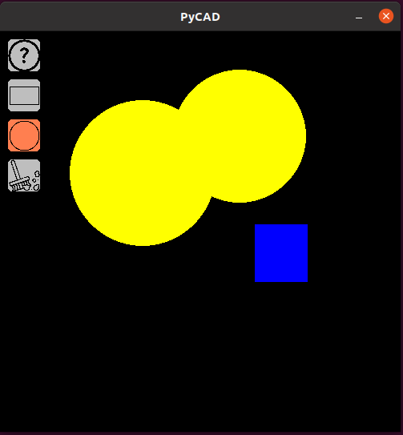

# PyCAD

Simple CAD designed using pygame. It is still a work in progress project, so if you want to contribute fork this repository, make the changes into the forked repository and push a new Merge Request to 'main' branch. Open an issue in case of big MRs.

# To use it
```
clone the repository
$ pip install -r requirements.txt
$ python3.10 -m venv venv
$ source venv/bin/activate
$ python main.py
```

# Usage
Draw imgages. It saves the content to file `data.pickle` when the application is closed and reloads it next time the application is opened.



# Icons reference
 - <a href="https://www.flaticon.com/free-icons/circle" title="circle icons">Circle icons created by DinosoftLabs - Flaticon</a>
 - <a href="https://www.flaticon.com/free-icons/clean" title="clean icons">Clean icons created by Freepik - Flaticon</a>
 - <a href="https://www.flaticon.com/free-icons/rectangle" title="rectangle icons">Rectangle icons created by PLANBSTUDIO - Flaticon</a>
 - <a href="https://www.flaticon.com/free-icons/question" title="question icons">Question icons created by Freepik - Flaticon</a>
 - <a href="https://www.flaticon.com/free-icons/error" title="error icons">Error icons created by Freepik - Flaticon</a>